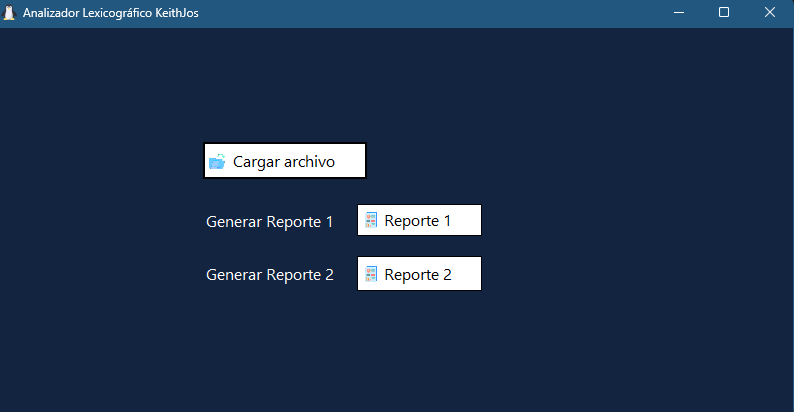

---

# Analizador Léxico para Lua con Interfaz Gráfica

Este proyecto es un analizador léxico para el lenguaje de programación Lua implementado utilizando la herramienta Lex. Además, incluye una interfaz gráfica que permite a los usuarios analizar.

## Características principales

- **Análisis Léxico Preciso:** Utiliza la potencia de Lex para realizar un análisis léxico preciso y eficiente de los programas Lua, identificando tokens y palabras clave de manera adecuada.

- **Interfaz Gráfica:** La interfaz gráfica proporciona una experiencia de usuario amigable, permitiendo cargar y analizar fácilmente el código Lua.

## Generación de Informes en PDF

Una de las características destacadas de este analizador léxico para Lua es su capacidad para generar informes en formato PDF que contienen información relevante sobre el código Lua analizado. Estos informes incluyen:

- Lista de tokens identificados en el código.
- Estadísticas sobre la frecuencia de aparición de palabras clave.

La generación de informes en formato PDF facilita la revisión y el análisis detallado del código Lua, lo que puede ser útil para los desarrolladores y diseñadores. Para generar un informe en PDF, simplemente sigue estos pasos:

1. Carga el código Lua que deseas analizar utilizando la interfaz gráfica.
2. Generar un informe en formato PDF.

## Capturas de Pantalla

## Contribuciones

¡Las contribuciones son bienvenidas! Si deseas mejorar esta herramienta o agregar nuevas características, no dudes en hacer una solicitud de extracción.

## Licencia

Este proyecto está bajo la Licencia apache 2-0. 

---
